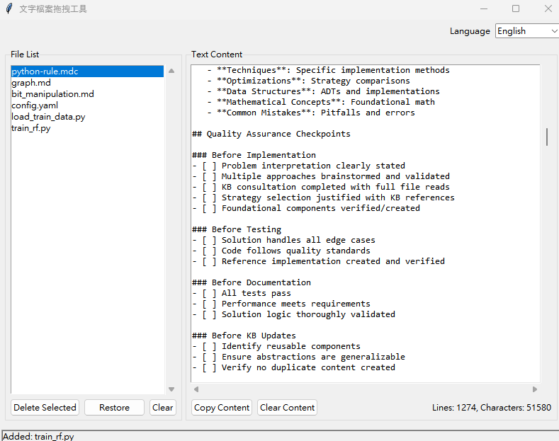

# 文字檔案拖拽工具

> **語言選擇 / Language Selection:**  
> 🇹🇼 [繁體中文](README.md) | 🇺🇸 [English](README_EN.md)

一個基於Python和Tkinter開發的GUI應用程式，支援拖拽文字檔案並顯示其內容。



## 功能特色

### 🎯 主要功能
1. **增強拖拽支援** - 支援多種來源的檔案拖拽（檔案總管、其他程式、文字路徑）
2. **檔案列表管理** - 顯示已新增的檔案列表
3. **文字內容顯示** - 在可滾動的文字區域中顯示檔案內容
4. **檔案操作** - 支援刪除和復原檔案
5. **內容複製** - 一鍵複製所有文字內容到剪貼簿
6. **智慧剪貼簿** - Ctrl+V 智慧分析剪貼簿內容（檔案或文字）
7. **多語言支援** - 支援中文和英文介面切換
8. **狀態持久化** - 自動保存程式狀態，重啟後恢復上次的檔案列表

### 📁 支援的檔案格式
- 程式語言檔案：`.py`, `.cpp`, `.c`, `.h`, `.java`, `.js`, `.php`, `.go`, `.rs` 等
- 標記語言檔案：`.html`, `.xml`, `.md`, `.rst`, `.yaml` 等
- 設定檔案：`.ini`, `.cfg`, `.conf`, `.json` 等
- 文字檔案：`.txt`, `.log` 等
- 腳本檔案：`.sh`, `.bat`, `.ps1` 等

## 安裝需求

### 系統需求
- Windows 10/11
- Python 3.7+

### 依賴套件
```bash
pip install -r requirements.txt
```

主要依賴：
- `tkinterdnd2` - 拖拽功能支援
- `pyperclip` - 剪貼簿操作
- `pywin32` - Windows 剪貼簿 API

## 使用方法

### 啟動程式
```bash
python main.py
```

### 基本操作

#### 1. 新增檔案
- **從檔案總管拖拽**：將文字檔案從檔案總管拖拽到程式視窗的任何位置
- **從其他程式拖拽**：支援從文字編輯器、IDE等程式拖拽檔案路徑
- **多種路徑格式**：支援標準路徑、引號路徑、多行路徑等格式
- **智慧剪貼簿貼上**：按 Ctrl+V 智慧分析剪貼簿內容
  - 檔案複製：從檔案總管複製檔案後貼上，自動讀取檔案內容
  - 文字複製：複製文字後貼上，自動創建 paste-text_*.txt 檔案
- **自動狀態保存**：新增檔案後自動保存到系統暫存目錄
- 支援的檔案會自動新增到左側列表
- 檔案內容會顯示在右側文字區域

#### 2. 管理檔案列表
- **選擇檔案**：點擊列表中的檔案名稱
- **刪除檔案**：選中檔案後點擊「刪除選中」按鈕，或雙擊檔案
- **復原檔案**：點擊「復原」按鈕恢復最後刪除的檔案
- **清空列表**：點擊「清空」按鈕移除所有檔案

#### 3. 文字內容操作
- **複製內容**：點擊「複製內容」按鈕將所有文字複製到剪貼簿
- **清空內容**：點擊「清空內容」按鈕清除文字顯示區域

#### 4. 剪貼簿操作
- **智慧貼上**：按 Ctrl+V 自動分析剪貼簿內容
- **檔案貼上**：從檔案總管複製檔案（Ctrl+C），然後在程式中貼上（Ctrl+V）
- **文字貼上**：複製任何文字內容，貼上後自動創建臨時文字檔案
- **自動命名**：文字檔案自動命名為 paste-text_1.txt, paste-text_2.txt 等，避免覆蓋

#### 5. 語言切換
- **語言選擇**：點擊右上角的語言下拉選單
- **支援語言**：中文（繁體）和英文
- **即時切換**：選擇語言後介面立即更新

### 介面說明

```
┌─────────────────────────────────────────────────────────────┐
│                文字檔案拖拽工具                [語言: 中文 ▼] │
├─────────────────┬───────────────────────────────────────────┤
│   檔案列表      │              文字內容                     │
│ ┌─────────────┐ │ ┌───────────────────────────────────────┐ │
│ │ file1.py    │ │ │ === file1.py ===                     │ │
│ │ file2.txt   │ │ │ print("Hello World")                 │ │
│ │ file3.md    │ │ │                                       │ │
│ │             │ │ │ === file2.txt ===                    │ │
│ └─────────────┘ │ │ This is a text file...               │ │
│ [刪除][復原][清空] │ └───────────────────────────────────────┘ │
│                 │ [複製內容] [清空內容]    行數: 25, 字元數: 512 │
├─────────────────┴───────────────────────────────────────────┤
│ 狀態：拖拽文字檔案到此視窗以新增到列表                        │
└─────────────────────────────────────────────────────────────┘
```

## 程式架構

### 目錄結構
```
drag_n_paste/
├── main.py                 # 主程式入口
├── requirements.txt        # 依賴套件
├── README.md              # 說明文件（中文）
├── README_EN.md           # 說明文件（英文）
├── USAGE_EXAMPLES.md      # 使用示例
├── CHANGELOG.md           # 更新日誌
├── LICENSE                # GPL 3.0 授權條款
├── install.bat            # Windows安裝腳本
├── run.bat               # Windows啟動腳本
├── img/                   # 圖片資源
│   └── demo.png          # 程式示意圖
├── test_sample/           # 測試檔案
│   ├── test_chinese.txt   # 中文測試檔案
│   ├── test_sample.py     # Python測試檔案
│   └── test_sample.txt    # 文字測試檔案
├── core/                  # 核心功能模組
│   ├── file_handler.py    # 檔案處理
│   ├── file_validator.py  # 檔案驗證
│   ├── state_manager.py   # 狀態管理
│   └── clipboard_handler.py # 剪貼簿處理
├── gui/                   # GUI元件模組
│   ├── main_window.py     # 主視窗
│   ├── file_list_widget.py # 檔案列表元件
│   ├── text_display_widget.py # 文字顯示元件
│   └── language_selector.py # 語言選擇元件
└── utils/                 # 工具模組
    ├── constants.py       # 常數定義
    └── i18n.py           # 國際化翻譯模組
```

### 設計原則
- **原子化**：每個檔案只提供一個基本功能
- **樹狀結構**：使用資料夾進行模組化管理
- **低耦合**：適當拆解耦合，降低模組間依賴
- **觀察者模式**：語言切換使用觀察者模式，避免硬編碼

## 特色功能

### 🔄 智慧檔案處理
- 自動檢測檔案編碼（UTF-8、GBK、Big5等）
- 支援多種文字檔案格式
- 重複檔案檢測
- Unicode字元完整支援
- **增強拖拽解析**：支援多種拖拽來源和路徑格式
- **智慧剪貼簿**：Ctrl+V 自動分析檔案或文字內容
- **狀態持久化**：自動保存/載入程式狀態到系統暫存目錄

### 🎨 使用者友善介面
- 現代化的GUI設計
- 可調整的分割視窗
- 即時狀態回饋
- 滾動條支援
- 多語言介面（中文/英文）
- 觀察者模式實現即時語言切換

### 📋 便利的操作
- 拖拽檔案新增
- **Ctrl+V 智慧剪貼簿貼上**：
  - 自動檢測檔案或文字內容
  - 檔案自動讀取並添加到列表
  - 文字自動創建 paste-text_*.txt 檔案
  - 避免檔案名稱衝突
- 一鍵複製所有內容
- 復原刪除功能
- 批次清空操作

## 故障排除

### 常見問題

**Q: 拖拽檔案沒有反應？**
A: 請確認：
- 檔案是支援的文字格式
- 檔案沒有被其他程式鎖定
- 檔案路徑不包含特殊字元
- 嘗試不同的拖拽方式（從檔案總管、文字編輯器等）

**Q: 檔案內容顯示亂碼？**
A: 程式會自動嘗試多種編碼，如果仍有問題，請確認檔案編碼是否為常見格式。

**Q: 複製功能無法使用？**
A: 請確認已安裝 `pyperclip` 套件，並且系統剪貼簿功能正常。

**Q: Ctrl+V 貼上功能無法使用？**
A: 請確認：
- 已安裝 `pywin32` 套件（Windows 剪貼簿 API）
- 剪貼簿中有內容（文字或檔案）
- 程式視窗有焦點
- 對於檔案貼上，確認檔案是支援的文字格式

## 快速開始

1. **安裝依賴**：
   ```bash
   .\install.bat
   ```

2. **啟動程式**：
   ```bash
   .\run.bat
   # 或
   python main.py
   ```

3. **測試功能**：
   - 拖拽 `test_sample/test_chinese.txt` 測試Unicode字元支援
   - 拖拽 `test_sample/test_sample.py` 測試程式碼檔案支援
   - 複製一些文字，然後按 Ctrl+V 測試文字貼上功能
   - 在檔案總管中複製文字檔案，然後按 Ctrl+V 測試檔案貼上功能
   - 使用右上角下拉選單切換語言

## 版本歷史

詳細版本歷史請參閱 [CHANGELOG.md](CHANGELOG.md)。

## 相關連結

- [使用示例 (Usage Examples)](USAGE_EXAMPLES.md)
- [更新日誌 (Changelog)](CHANGELOG.md)

## 授權

本專案採用 GPL 3.0 授權條款。

## 貢獻

歡迎提交 Issue 和 Pull Request 來改善這個專案！ 