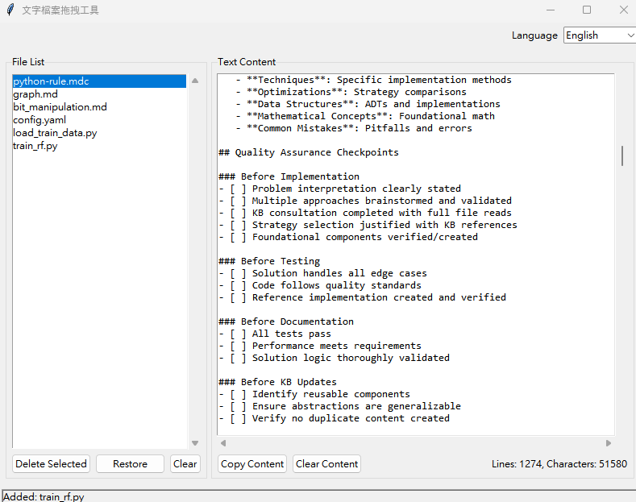

# 文字檔案拖拽工具 / Text File Drag & Drop Tool



## 文檔 / Documentation

### 📖 說明文件 / User Manual
- [🇹🇼 中文說明文件](README.md)
- [🇺🇸 English Documentation](README_EN.md)

### 📋 更新日誌 / Changelog
- [📝 更新日誌 / Changelog](CHANGELOG.md)

### 🚀 快速開始 / Quick Start

#### 安裝 / Installation
```bash
# Windows
.\install.bat

# Manual installation
pip install -r requirements.txt
```

#### 執行 / Run
```bash
# Windows
.\run.bat

# Manual run
python main.py
```

### 🌟 主要功能 / Key Features

| 功能 / Feature | 中文 / Chinese | English |
|---|---|---|
| 拖拽支援 | ✅ 支援拖拽文字檔案 | ✅ Drag & drop text files |
| 多語言 | ✅ 中文/英文切換 | ✅ Chinese/English switching |
| 檔案管理 | ✅ 新增/刪除/復原 | ✅ Add/Delete/Restore |
| 內容複製 | ✅ 一鍵複製所有內容 | ✅ One-click copy all content |
| Unicode支援 | ✅ 完整Unicode字元支援 | ✅ Full Unicode character support |

### 📁 支援格式 / Supported Formats
- **程式語言 / Programming**: `.py`, `.cpp`, `.c`, `.h`, `.java`, `.js`, `.php`, `.go`, `.rs`
- **標記語言 / Markup**: `.html`, `.xml`, `.md`, `.rst`, `.yaml`
- **設定檔案 / Config**: `.ini`, `.cfg`, `.conf`, `.json`
- **文字檔案 / Text**: `.txt`, `.log`
- **腳本檔案 / Scripts**: `.sh`, `.bat`, `.ps1`

---

**選擇您的語言 / Choose Your Language:**
- [🇹🇼 繁體中文](README.md)
- [🇺🇸 English](README_EN.md) 